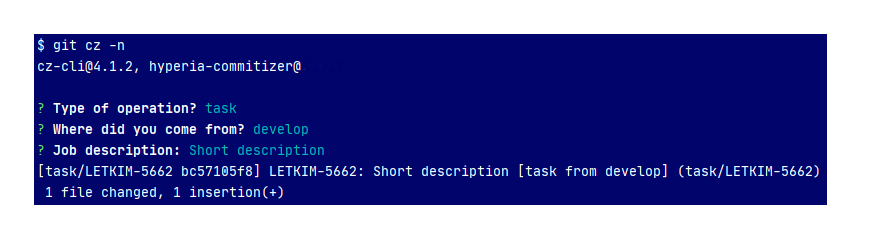

# hyperia-commitizer

A commitizen adapter for [Jira smart commits](https://confluence.atlassian.com/display/FISHEYE/Using+smart+commits).



## Global Installation

For a quick global installation of the plugin, simply run the `install.sh` script present in this repo:

```
chmod +x install.sh

./install.sh
```

## Add this adapter

Install this adapter

```
npm i @hyperia/hyperia-commitizer
```

## Create `.cz.json`

```json
{
  "path": "node_modules/@hyperia/hyperia-commitizer"
}
```


## Run 

- with pre-commit `git cz`
- without pre-commit `git cz -n`

## Program process

after run:
- auto run command: `git add -A`
- question **<list (type)>**: _Type of operation:_ `['task', 'bug', 'fix', 'update', 'merging', 'test', 'refactoring', 'experiment']`
- question **<list (from)>**: _Where did you come from?:_ `['develop', 'beta', 'rc-branch', 'master', 'other']`
- if **<list (from)> == other**: question **<input (fromManual)>**: _Name of the parent branch:_
- question **<input (workflow)>**: _Job description:_
- create commit from question and actual branch name in format:
```
<shortBranchName after '/' before second '-' >: <workflow> [<type> from <fromManual ?? from> ] (<actualBranchName>)
```
## shortBranchName example
- if actualBranchName contains `task/`
  - actualBranchName: `task/JIRA-5555` => shortBranchName: `JIRA-5555`
  - actualBranchName: `task/JIRA-5555-1` => shortBranchName: `JIRA-5555`
- if actualBranchName do not contains `task/`
  - actualBranchName: `rc-branch` => shortBranchName: `rc-branch`
  - actualBranchName: `example-branch-name` => shortBranchName: `example-branch-name`
  
## Example
- actual branch: `task/JIRA-5555-1`
- finnal commit: `JIRA-5555: Job description... [task from dev] (task/JIRA-5555-1)`


